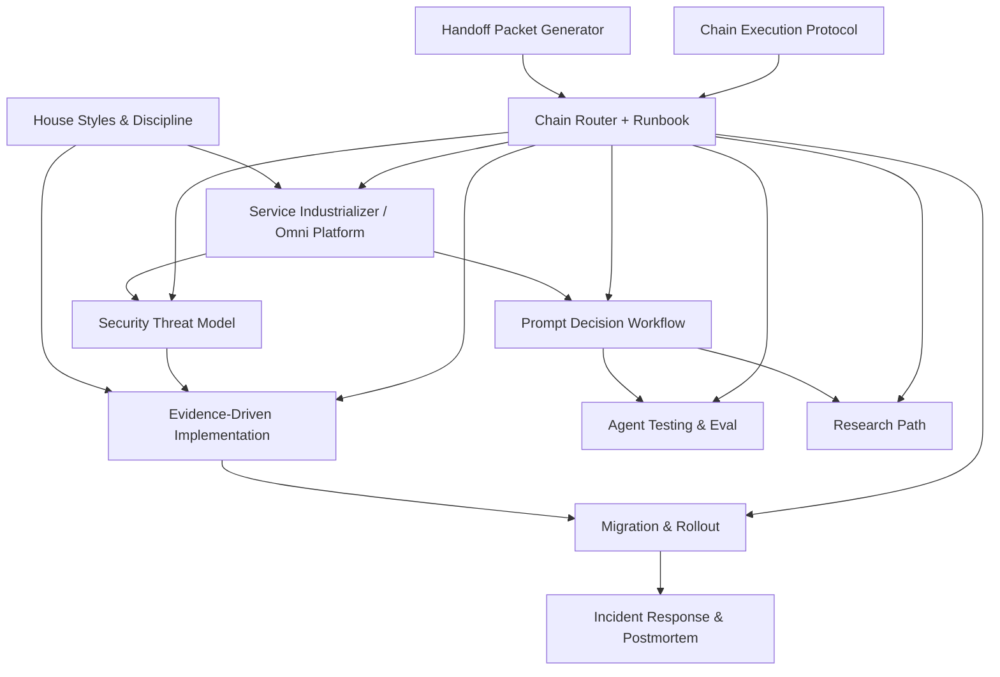

# Prompt Ecosystem Ontology

This ontology models the library as a **directed ecosystem**:

artifacts (prompts/guidelines/indexes). domains (what the artifact is about). techniques (what the artifact *does*). relationships (how artifacts compose into chains). (Order preserved.)
The goal is not academic purity; it’s practical routing: **given an objective, pick the right prompt(s) and order them safely**.

---

## 1) Core entity types

### 1.1 Artifact
An **Artifact** is any first-class Markdown object in the library:

prompts (procedural, phased, actionable). guidelines (constraints/standards). indexes/readmes (navigation). intermediate orchestrators (routers/handoffs/protocols). (Order preserved.)
Minimum fields:

`id`: stable identifier (e.g. `EC-03`). `title`: human label. `kind`: prompt | guidelines | index. `domain_tags`: e.g. `repo-analysis`, `routing`, `security`. `techniques`: e.g. `phases`, `evidence-ledger`, `schema-first`. `inputs`: what it requires to run. `outputs`: deliverables it promises. (Order preserved.)
### 1.2 Domain
A **Domain** is a topical cluster:

`repo-analysis` / `implementation`. `agent-systems`. `routing` / `workflow`. `knowledge-graph`. `multimodal` / `image-restoration`. `security`. `ops` / `observability`. `meta-orchestration`. (Order preserved.)
### 1.3 Technique
A **Technique** is a reusable behavioral primitive (components you can compose):

phased workflow. evidence → hypothesis → next-actions loop. constraint matrices. schema-first tool design. termination gates / stop conditions. abstraction budgets (anti-bloat). safety/approval gates (mutations). regression/eval harness design. (Order preserved.)
### 1.4 Relationship
Relationships are edges between artifacts:

`COMBINES_WITH` (A is a combo of B+C). `ENFORCES` (A enforces guideline G). `ROUTES_TO` (A selects and dispatches to B). `PRECEDES` (A should run before B). `PRODUCES_INPUT_FOR` (A outputs data B requires). (Order preserved.)
---

## 2) Canonical ecosystem graph (high-level)

Interpretation:

**House styles** constrain implementation prompts. **Security** often precedes implementation for high-risk objectives. **Rollout** precedes production deploy. **Incident response** is an interrupt handler: it can preempt the chain. (Order preserved.)
---

## 3) Artifact IDs included in this book

`F-01` → `graph/nodes/misc/python_house_style.md`. `F-02` → `graph/nodes/misc/rust_house_style.md`. `F-03` → `graph/nodes/misc/rust_antibloat.md`. `F-04` → `graph/nodes/misc/colab_notebook_house_style.md`. `C-01` → `graph/nodes/implementation/agent_architect_10_phase_agent_systems_blueprint.md`. `C-02` → `graph/nodes/discovery/repo_discovery_massive_prompt.md`. `C-03` → `graph/nodes/discovery/python_repo_discovery_engineer.md`. `C-04` → `graph/nodes/discovery/rust_repo_discovery_engineer.md`. `C-05` → `graph/nodes/discovery/explore_repo.md`. `M-01` → `graph/nodes/implementation/restore_simple_openai.md`. `EC-01` → `graph/nodes/implementation/omni_agent_platform.md`. `EC-02` → `graph/nodes/implementation/evidence_driven_implementation.md`. `EC-03` → `graph/nodes/implementation/prompt_decision_workflow.md`. `EC-04` → `graph/nodes/implementation/prompt_library_composer.md`. `EC-05` → `graph/nodes/implementation/multimodal_restoration_pipeline.md`. `EC-06` → `graph/nodes/implementation/service_industrializer.md`. `EC-07` → `graph/nodes/execution/agent_testing_eval_gauntlet.md`. `EC-08` → `graph/nodes/security/security_threat_model.md`. `EC-09` → `graph/nodes/migration/migration_and_rollout.md`. `EC-10` → `graph/nodes/incident_response/incident_response_and_postmortem.md`. `EC-11` → `graph/nodes/execution/chain_router_and_runbook.md`. `EC-12` → `graph/nodes/execution/handoff_packet_generator.md`. `EC-13` → `graph/nodes/execution/chain_execution_protocol.md`. `IR-01` → `graph/nodes/execution/image_restoration_pipeline_router.md`. `IR-02` → `graph/nodes/implementation/image_restoration_pipeline_builder_python.md`. `IR-03` → `graph/nodes/implementation/image_restoration_pipeline_builder_rust.md`. `P-01` → `graph/workflows/README.md`. `P-02` → `graph/workflows/image_restoration_python_branch.md`. `P-03` → `graph/workflows/image_restoration_rust_branch.md`. `META-01` → `docs/repo_mental_model.md`. `META-02` → `docs/agent_specs/repo_forensic_arch_diagnostic_agent_spec.md`. `P-04` → `graph/workflows/objective_to_product_pipeline.md`. `META-03` → `docs/phase_groups.md`. `PH-01` → `graph/nodes/execution/objective_to_product_phase_pipeline.md`. `PH-02` → `graph/nodes/exploratory/objective_intake_and_context_map.md`. `PH-03` → `graph/nodes/planning/product_plan_compiler.md`. `PH-04` → `graph/nodes/implementation/product_build_executor.md`. `P-05` → `graph/workflows/initial_prompt_graph_workflow.md`. `P-06` → `graph/workflows/python_branch.md`. `P-07` → `graph/workflows/rust_branch.md`. (Order preserved.)
---

## 4) Prompt selection heuristics (routing rules)

Use these rules when deciding what to run:

1. If there is an active outage or customer incident → run **Incident Response** first.
2. If the objective is a small feature/bugfix → run **Evidence-Driven Implementation**.
3. If the objective is ‘turn repo into a service/tool platform’ → run **Omni Agent Platform** or **Service Industrializer**.
4. If the objective is a research synthesis → route to **Research Path** first.
5. If anything touches prod → run **Migration & Rollout**.
6. If agents/tools must be reliable → run **Agent Testing & Eval Gauntlet**.

---

## 5) Ontology exports

See `book/ontology/` for machine-readable exports:

`prompt_ecosystem.json`. `prompt_ecosystem.jsonld`. `prompt_ecosystem.yaml`. (Order preserved.)
